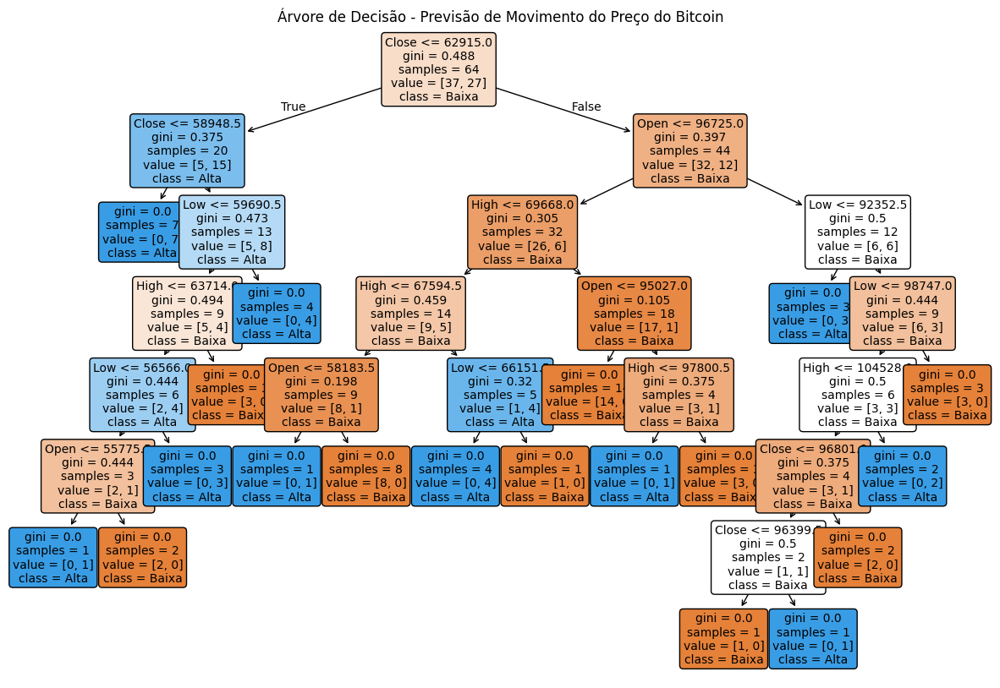

# Programa em Python que utiliza uma API de previsão de preços de criptomoedas

````py
import requests                 # Biblioteca para fazer requisições HTTP (acessar APIs)
import pandas as pd             # Biblioteca para manipulação e análise de dados (DataFrames)
import matplotlib.pyplot as plt # Biblioteca para plotagem de gráficos
from sklearn.model_selection import train_test_split  # Para dividir os dados em treino e teste
from sklearn.tree import DecisionTreeClassifier, plot_tree  # Modelo de árvore de decisão e função para plotar
from sklearn.metrics import classification_report   # Para avaliar o desempenho do modelo

# ===========================================================
# 1. COLETA DOS DADOS VIA API DO COINGECKO
# ===========================================================

# URL da API do CoinGecko para obter dados OHLC (Abertura, Máxima, Mínima e Fechamento)
# dos últimos 365 dias para o Bitcoin (ticker: bitcoin)
url = "https://api.coingecko.com/api/v3/coins/bitcoin/ohlc?vs_currency=usd&days=365"

# Fazendo a requisição GET para a API utilizando a URL
resposta = requests.get(url)

# Verifica se a requisição foi bem-sucedida (status 200 indica sucesso)
if resposta.status_code == 200:
    # Converte a resposta JSON para uma estrutura Python (lista de listas)
    dados = resposta.json()
    print("Dados recebidos da API CoinGecko (exibindo as 5 primeiras entradas):")
    print(dados[:5])
else:
    print(f"Erro na requisição: {resposta.status_code}")

# ===========================================================
# 2. CONVERSÃO DOS DADOS PARA DATAFRAME E SALVAMENTO EM CSV
# ===========================================================

# Cada entrada dos dados é no formato: [timestamp, Open, High, Low, Close]
# Converter para DataFrame com colunas nomeadas
df = pd.DataFrame(dados, columns=["timestamp", "Open", "High", "Low", "Close"])

# Converter o timestamp (em milissegundos) para data (formato YYYY-MM-DD)
df["Data"] = pd.to_datetime(df["timestamp"], unit="ms").dt.date

# Remover a coluna 'timestamp', pois agora temos a coluna 'Data'
df.drop("timestamp", axis=1, inplace=True)

# Exibir as 5 primeiras linhas do DataFrame
print("\nDados convertidos para DataFrame:")
print(df.head())

# Salvar os dados em um arquivo CSV
nome_csv = "bitcoin_2025.csv"
df.to_csv(nome_csv, index=False)
print(f"\nDados salvos no arquivo '{nome_csv}'.")

# ===========================================================
# 3. CRIAÇÃO DA VARIÁVEL ALVO PARA CLASSIFICAÇÃO
# ===========================================================

# Criar a coluna 'Target' para indicar se o preço de fechamento do próximo dia é maior que o de hoje:
# Se o fechamento do próximo dia (Close.shift(-1)) for maior que o de hoje, Target = 1 (Alta), senão 0 (Baixa)
df["Target"] = (df["Close"].shift(-1) > df["Close"]).astype(int)

# Remover a última linha, que ficará com valor NaN em 'Target' (pois não há "próximo dia")
df = df.dropna().reset_index(drop=True)

# Criar uma coluna 'Movimento' com rótulos mais intuitivos
df["Movimento"] = df["Target"].apply(lambda x: "Alta" if x == 1 else "Baixa")

# Exibir as primeiras linhas do DataFrame final
print("\nDataFrame final com a variável alvo:")
print(df.head())

# ===========================================================
# 4. TREINAMENTO DO MODELO DE ÁRVORE DE DECISÃO
# ===========================================================

# Selecionar as variáveis (features) que serão utilizadas para previsão
# Neste exemplo, usamos: Open, High, Low e Close
X = df[["Open", "High", "Low", "Close"]]
# A variável alvo é 'Target'
y = df["Target"]

# Dividir os dados em conjuntos de treino (70%) e teste (30%)
X_treino, X_teste, y_treino, y_teste = train_test_split(X, y, test_size=0.3, random_state=42)

# Criar e treinar o modelo de árvore de decisão
modelo = DecisionTreeClassifier(random_state=42)
modelo.fit(X_treino, y_treino)

# Fazer previsões no conjunto de teste
y_pred = modelo.predict(X_teste)

# Exibir o relatório de classificação (precisão, recall, f1-score, etc.)
print("\nRelatório de Classificação:")
print(classification_report(y_teste, y_pred, target_names=["Baixa", "Alta"]))

# ===========================================================
# 5. VISUALIZAÇÃO DA ÁRVORE DE DECISÃO
# ===========================================================

plt.figure(figsize=(15, 10))  # Define o tamanho do gráfico
plot_tree(
    modelo,                                   # Modelo treinado
    feature_names=["Open", "High", "Low", "Close"],  # Nomes das features
    class_names=["Baixa", "Alta"],            # Nomes das classes
    filled=True,                              # Preenche os nós com cores
    rounded=True,                             # Nós com bordas arredondadas
    fontsize=10                               # Tamanho da fonte
)
plt.title("Árvore de Decisão - Previsão de Movimento do Preço do Bitcoin")
plt.show()

````
## Saída Esperada:
````text
Dados recebidos da API CoinGecko (exibindo as 5 primeiras entradas):
[[1708300800000, 51657.0, 52377.0, 51215.0, 52138.0], [1708646400000, 52117.0, 52902.0, 50706.0, 51320.0], [1708992000000, 51295.0, 54925.0, 50598.0, 54478.0], [1709337600000, 54528.0, 63637.0, 54478.0, 62427.0], [1709683200000, 62418.0, 68913.0, 60861.0, 64292.0]]

Dados convertidos para DataFrame:
      Open     High      Low    Close        Data
0  51657.0  52377.0  51215.0  52138.0  2024-02-19
1  52117.0  52902.0  50706.0  51320.0  2024-02-23
2  51295.0  54925.0  50598.0  54478.0  2024-02-27
3  54528.0  63637.0  54478.0  62427.0  2024-03-02
4  62418.0  68913.0  60861.0  64292.0  2024-03-06

Dados salvos no arquivo 'bitcoin_2025.csv'.

DataFrame final com a variável alvo:
      Open     High      Low    Close        Data  Target Movimento
0  51657.0  52377.0  51215.0  52138.0  2024-02-19       0     Baixa
1  52117.0  52902.0  50706.0  51320.0  2024-02-23       1      Alta
2  51295.0  54925.0  50598.0  54478.0  2024-02-27       1      Alta
3  54528.0  63637.0  54478.0  62427.0  2024-03-02       1      Alta
4  62418.0  68913.0  60861.0  64292.0  2024-03-06       1      Alta

Relatório de Classificação:
              precision    recall  f1-score   support

       Baixa       0.24      0.44      0.31         9
        Alta       0.55      0.32      0.40        19

    accuracy                           0.36        28
   macro avg       0.39      0.38      0.35        28
weighted avg       0.45      0.36      0.37        28
````



