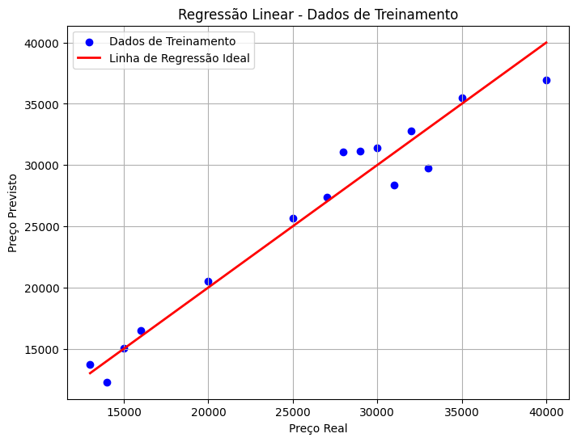

# Pipeline utilizando a biblioteca Scikit-Learn para prever o preço de automóveis

`````py
import pandas as pd
import matplotlib.pyplot as plt
from sklearn.compose import ColumnTransformer
from sklearn.preprocessing import OneHotEncoder, StandardScaler
from sklearn.linear_model import LinearRegression
from sklearn.pipeline import Pipeline
from sklearn.metrics import mean_squared_error

# 1. Leitura dos dados a partir dos arquivos Excel
train_df = pd.read_excel('car_price_train.xlsx')
test_df = pd.read_excel('car_price_test.xlsx')

# 2. Separando features e target para os dados de treinamento
X_train = train_df.drop('Preco', axis=1)
y_train = train_df['Preco']

# Para os dados de teste, já que não temos a coluna 'Preco'
X_test = test_df.copy()

# 3. Configurando o pré-processamento com ColumnTransformer:
#    - OneHotEncoder para a coluna 'Combustivel'
#    - StandardScaler para as colunas 'Idade' e 'Quilometragem'
preprocessor = ColumnTransformer(
    transformers=[
        ('cat', OneHotEncoder(), ['Combustivel']),
        ('num', StandardScaler(), ['Idade', 'Quilometragem'])
    ]
)

# 4. Criando o pipeline com o pré-processamento e o modelo de regressão linear
pipeline = Pipeline(steps=[
    ('preprocessor', preprocessor),
    ('regressor', LinearRegression())
])

# 5. Treinando o modelo com os dados de treinamento
pipeline.fit(X_train, y_train)

# 6. Fazendo previsões
train_pred = pipeline.predict(X_train)
test_pred = pipeline.predict(X_test)

# 7. Avaliando o desempenho nos dados de treinamento (MSE)
mse_train = mean_squared_error(y_train, train_pred)
print(f'MSE nos dados de treinamento: {mse_train:.2f}')

# 8. Criando DataFrames com as previsões

# Previsões para os dados de treinamento: adiciona as colunas Preco Real e Preco Previsto
train_results = X_train.copy()
train_results['Preco Real'] = y_train
train_results['Preco Previsto'] = train_pred

# Previsões para os dados de teste: adiciona a coluna Preco Previsto
test_results = X_test.copy()
test_results['Preco Previsto'] = test_pred

print("\nPrevisões para os dados de treinamento:")
print(train_results)

print("\nPrevisões para os dados de teste:")
print(test_results)

# 9. Plot: Gráfico de regressão linear para os dados de treinamento
# Neste exemplo, vamos plotar Preco Real vs Preco Previsto.
plt.figure(figsize=(8, 6))
plt.scatter(y_train, train_pred, color='blue', label='Dados de Treinamento')
# Linha de referência: y = x (onde o valor previsto seria igual ao valor real)
plt.plot([y_train.min(), y_train.max()], [y_train.min(), y_train.max()], color='red', lw=2, label='Linha de Regressão Ideal')
plt.xlabel('Preço Real')
plt.ylabel('Preço Previsto')
plt.title('Regressão Linear - Dados de Treinamento')
plt.legend()
plt.grid(True)
plt.show()

``````

## Saída Esperada:

```text
MSE nos dados de treinamento: 3230647.68
````

### Previsões para os dados de treinamento:

| Combustível | Idade | Quilometragem | Preço Real | Preço Previsto |
|-------------|-------|----------------|------------|----------------|
| Gasolina    | 5     | 50000          | 30000      | 31418.076464   |
| Diesel      | 3     | 30000          | 28000      | 31096.438867   |
| Etanol      | 10    | 100000         | 15000      | 15018.955828   |
| Gasolina    | 2     | 20000          | 35000      | 35526.424599   |
| Diesel      | 7     | 80000          | 25000      | 25660.221879   |
| Etanol      | 6     | 60000          | 20000      | 20496.753341   |
| Gasolina    | 4     | 40000          | 32000      | 32787.525842   |
| Diesel      | 3     | 35000          | 29000      | 31117.229130   |
| Etanol      | 12    | 120000         | 14000      | 12280.057071   |
| Gasolina    | 8     | 90000          | 27000      | 27351.308855   |
| Diesel      | 5     | 55000          | 31000      | 28378.330373   |
| Etanol      | 9     | 110000         | 16000      | 16471.566258   |
| Gasolina    | 1     | 15000          | 40000      | 36916.664240   |
| Diesel      | 4     | 45000          | 33000      | 29747.779751   |
| Etanol      | 11    | 130000         | 13000      | 13732.667501   |

### Previsões para os dados de teste:

| Combustível | Idade | Quilometragem | Preço Previsto |
|-------------|-------|----------------|----------------|
| Gasolina    | 6     | 60000          | 30048.627086   |
| Diesel      | 4     | 45000          | 29747.779751   |
| Etanol      | 8     | 80000          | 17757.854585   |
| Gasolina    | 3     | 30000          | 34156.975221   |
| Diesel      | 5     | 50000          | 28357.540110   |



