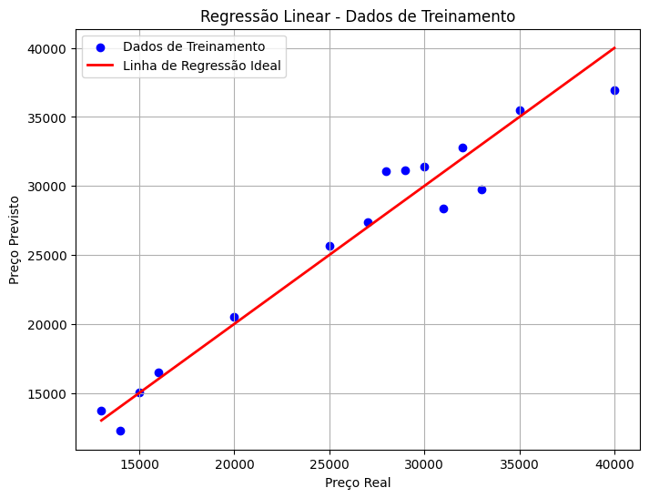

# Pipeline utilizando a biblioteca Scikit-Learn para prever o preço de automóveis
O código carrega dados de preços de carros e aplica regressão linear para prever preços com base em variáveis como idade, quilometragem e combustível. Utiliza um pipeline que pré-processa os dados com escalonamento e codificação antes de treinar o modelo. Após fazer as previsões, calcula o erro quadrático médio e apresenta os resultados para os dados de treinamento e teste. Um gráfico é gerado para comparar os preços reais e previstos no conjunto de treinamento.

## Saída Esperada:

```text
MSE nos dados de treinamento: 3230647.68
````

### Previsões para os dados de treinamento:

| Combustível | Idade | Quilometragem | Preço Real | Preço Previsto |
|-------------|-------|----------------|------------|----------------|
| Gasolina    | 5     | 50000          | 30000      | 31418.076464   |
| Diesel      | 3     | 30000          | 28000      | 31096.438867   |
| Etanol      | 10    | 100000         | 15000      | 15018.955828   |
| Gasolina    | 2     | 20000          | 35000      | 35526.424599   |
| Diesel      | 7     | 80000          | 25000      | 25660.221879   |
| Etanol      | 6     | 60000          | 20000      | 20496.753341   |
| Gasolina    | 4     | 40000          | 32000      | 32787.525842   |
| Diesel      | 3     | 35000          | 29000      | 31117.229130   |
| Etanol      | 12    | 120000         | 14000      | 12280.057071   |
| Gasolina    | 8     | 90000          | 27000      | 27351.308855   |
| Diesel      | 5     | 55000          | 31000      | 28378.330373   |
| Etanol      | 9     | 110000         | 16000      | 16471.566258   |
| Gasolina    | 1     | 15000          | 40000      | 36916.664240   |
| Diesel      | 4     | 45000          | 33000      | 29747.779751   |
| Etanol      | 11    | 130000         | 13000      | 13732.667501   |

### Previsões para os dados de teste:

| Combustível | Idade | Quilometragem | Preço Previsto |
|-------------|-------|----------------|----------------|
| Gasolina    | 6     | 60000          | 30048.627086   |
| Diesel      | 4     | 45000          | 29747.779751   |
| Etanol      | 8     | 80000          | 17757.854585   |
| Gasolina    | 3     | 30000          | 34156.975221   |
| Diesel      | 5     | 50000          | 28357.540110   |



