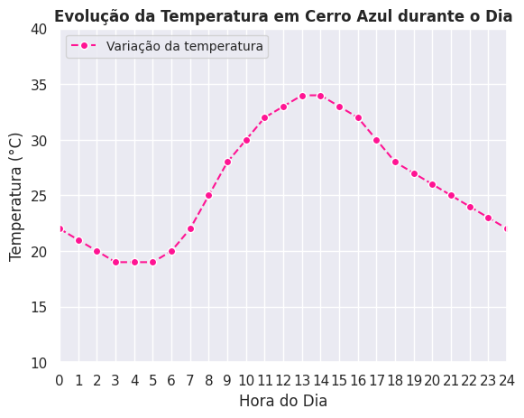

# Utilizando a biblioteca Matplotlib para gerar um gráfico de linha

Este código utiliza Matplotlib para criar um gráfico de linha que representa a variação da temperatura ao longo do dia em uma cidade.

## Saída Esperada:

