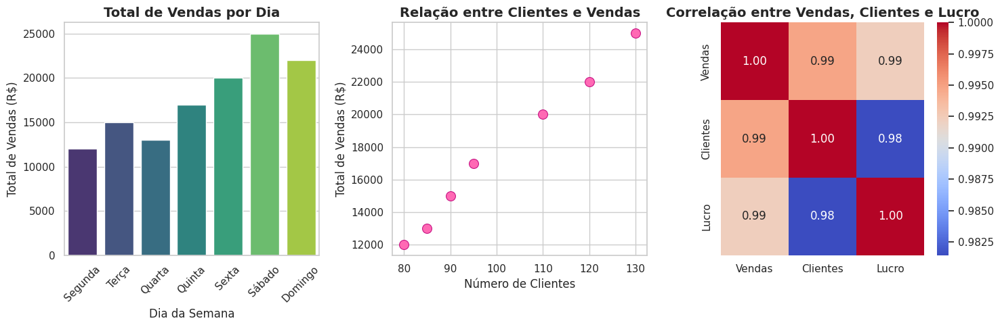

# Utilizando a biblioteca Seaborn para criar gráficos diversos
Este código utiliza as bibliotecas Seaborn, Matplotlib e Pandas para analisar e visualizar dados fictícios de vendas ao longo de uma semana, ajudando a entender padrões e relações entre as variáveis, como o impacto do número de clientes no total de vendas e a correlação entre lucro e vendas.

## Saída Esperada:

