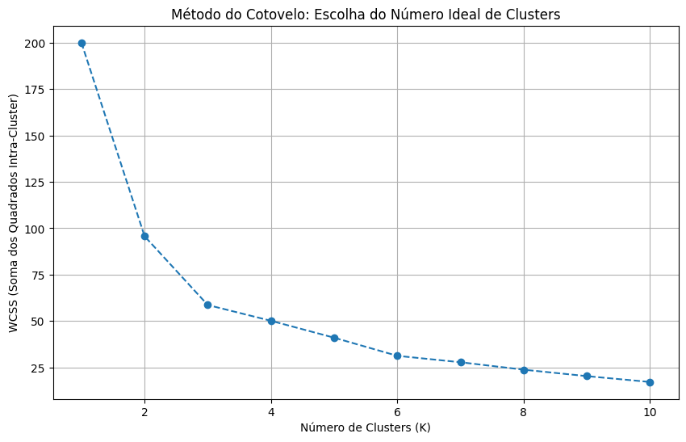
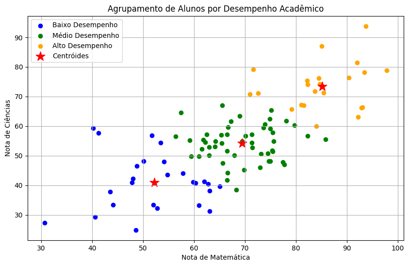

# Agrupamento de dados usando K-Means


## Saída Esperada:




### RESUMO POR CLUSTER:

| Nº Alunos | Média Mat | Desv. Mat | Mín Mat | Máx Mat | Média Cien | Desv. Cien | Mín Cien | Máx Cien |
|-----------|-----------|-----------|---------|---------|------------|------------|----------|----------|
| 26        | 52.2      | 8.8       | 30.7    | 65.1    | 41.0       | 9.3        | 24.9     | 59.4     |
| 52        | 69.5      | 6.6       | 56.4    | 85.9    | 54.2       | 6.1        | 38.5     | 66.9     |
| 22        | 85.2      | 7.5       | 71.0    | 97.8    | 73.4       | 7.9        | 60.0     | 93.8     |

`````text
Legenda:
- Alto Desempenho: Notas consistentemente acima da média
- Médio Desempenho: Notas próximas à média
- Baixo Desempenho: Notas abaixo da média, necessitando de reforço
``````

