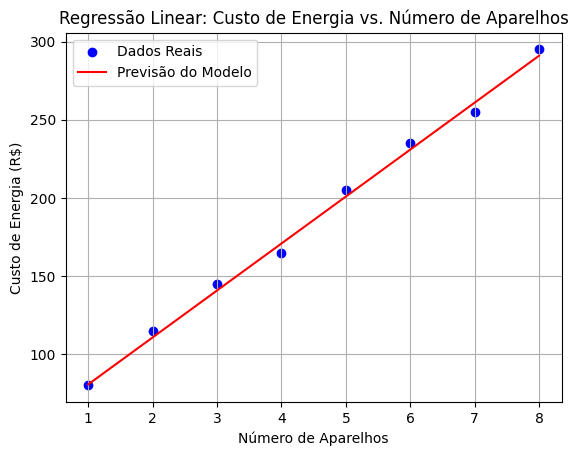

# Criando um gráfico de Regressão Linear
Esse código utiliza NumPy, Pandas, Matplotlib e Scikit-learn para construir um modelo de regressão linear, analisando a relação entre o número de aparelhos elétricos e o custo de energia. Ele divide os dados em treino e teste, treina o modelo para prever os custos e avalia sua precisão com o erro quadrático médio (MSE). Por fim, visualiza a relação entre as variáveis por meio de um gráfico de dispersão com uma linha de regressão.


## Saída Esperada:

`````text
Erro Quadrático Médio (MSE): 17.65
Coeficiente Angular (Custo por Aparelho): R$ 30.05
Custo Fixo Base (Intercepto): R$ 50.60

Dados de Teste:
→ Real: R$ 115 | Previsto: R$ 110.70
→ Real: R$ 235 | Previsto: R$ 230.90
``````



