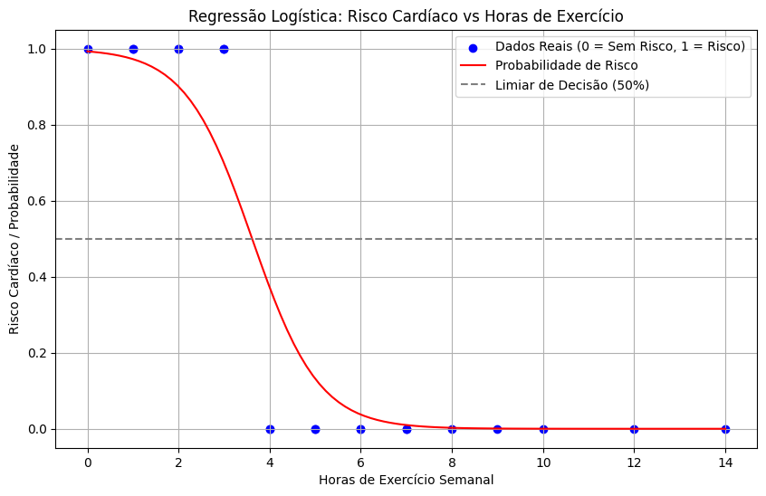

# Criando um gráfico de Regressão Logística


## Saída Esperada

````text
Acurácia nos dados de treino: 100.00%
Acurácia nos dados de teste: 100.00%
Coeficiente: -1.36 (Impacto das horas de exercício no risco)
Intercepto: 4.93
````

