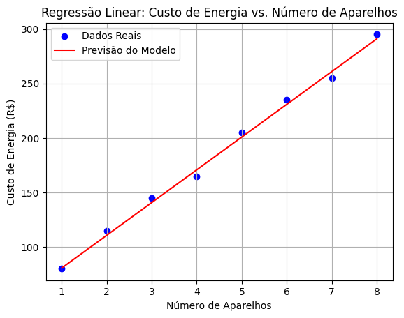

# Criando um gráfico de Regressão Linear

````py
# Importação das bibliotecas necessárias
import numpy as np
import pandas as pd
import matplotlib.pyplot as plt  # Biblioteca para plotar gráficos
from sklearn.model_selection import train_test_split
from sklearn.linear_model import LinearRegression
from sklearn.metrics import mean_squared_error

# Gerando dados de exemplo (número de aparelhos vs custo de energia)
data = {
    'num_appliances': [1, 2, 3, 4, 5, 6, 7, 8],
    'energy_cost': [80, 115, 145, 165, 205, 235, 255, 295]
}

# Convertendo para DataFrame
energy_data = pd.DataFrame(data)

# Dividindo as variáveis independentes (X) e dependente (y)
X = energy_data[['num_appliances']]
y = energy_data['energy_cost']

# Dividindo os dados em treino (75%) e teste (25%)
X_train, X_test, y_train, y_test = train_test_split(X, y, test_size=0.25, random_state=42)

# Criando e treinando o modelo
model = LinearRegression()
model.fit(X_train, y_train)

# Fazendo previsões
y_pred = model.predict(X_test)

# Avaliação do modelo
mse = mean_squared_error(y_test, y_pred)
print(f"\nErro Quadrático Médio (MSE): {mse:.2f}")

# Exibindo parâmetros do modelo
print(f"Coeficiente Angular (Custo por Aparelho): R$ {model.coef_[0]:.2f}")
print(f"Custo Fixo Base (Intercepto): R$ {model.intercept_:.2f}\n")

# Exibindo relação real vs prevista (para teste)
print("Dados de Teste:")
for real, previsto in zip(y_test, y_pred):
    print(f"→ Real: R$ {real} | Previsto: R$ {previsto:.2f}")

# Plotando o gráfico
plt.scatter(X, y, color='blue', label='Dados Reais')  # Pontos reais
plt.plot(X, model.predict(X), color='red', label='Previsão do Modelo')  # Linha de regressão
plt.xlabel('Número de Aparelhos')
plt.ylabel('Custo de Energia (R$)')
plt.title('Regressão Linear: Custo de Energia vs. Número de Aparelhos')
plt.legend()
plt.grid(True)  # Adiciona grades ao gráfico
plt.show()
``````


## Saída Esperada:

`````text
Erro Quadrático Médio (MSE): 17.65
Coeficiente Angular (Custo por Aparelho): R$ 30.05
Custo Fixo Base (Intercepto): R$ 50.60

Dados de Teste:
→ Real: R$ 115 | Previsto: R$ 110.70
→ Real: R$ 235 | Previsto: R$ 230.90
``````



