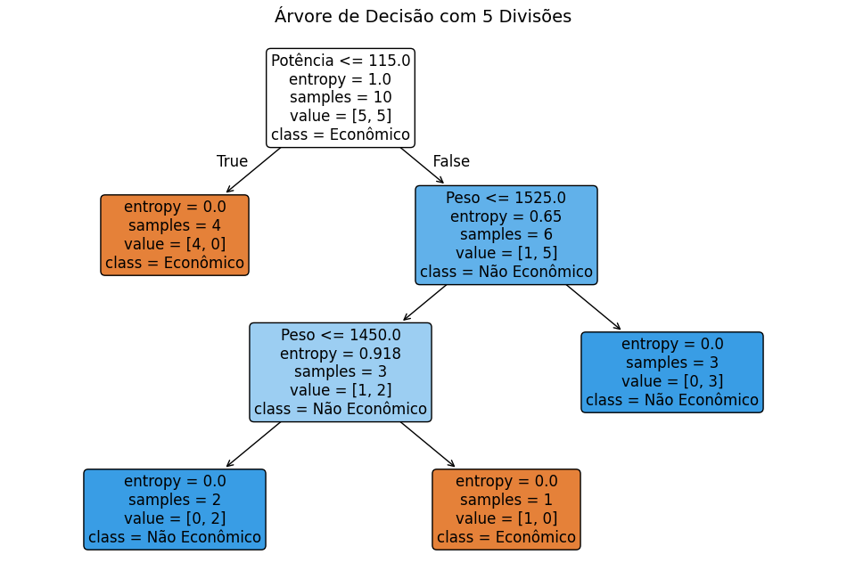

# Criando uma Árvore de decisão
Este código utiliza uma árvore de decisão para classificar carros em duas categorias: "Econômico" e "Não Econômico". Com base nas características de potência e peso, o modelo faz divisões para determinar a classe de cada carro. A árvore de decisão é treinada com um conjunto de dados que contém essas variáveis e, em seguida, é visualizada para entender como o modelo faz suas classificações. 

## Saída Esperada:



``````text
Regras da árvore de decisão:
  - Se Potência <= 115.00
    - Classe: Econômico
  - Senão (se Potência > 115.00)
    - Se Peso <= 1525.00
      - Se Peso <= 1450.00
        - Classe: Não Econômico
      - Senão (se Peso > 1450.00)
        - Classe: Econômico
    - Senão (se Peso > 1525.00)
      - Classe: Não Econômico
``````
